- [Introduction](#introduction)
- [Development Documents](#development-documents)
  - [Cookie Rules](#cookie-rules)
  - [Modules](#modules)
    - [Payment view(transactions)](#payment-viewtransactions)
      - [Payment view page store design](#payment-view-page-store-design)
      - [Transaction API details](#transaction-api-details)
      - [Dialogs navigation requirement and design](#dialogs-navigation-requirement-and-design)
      - [Balance Status](#balance-status)
      - [Transaction Status details](#transaction-status-details)
      - [Generate new payout test data](#generate-new-payout-test-data)
    - [Become teacher](#become-teacher)
    - [Checkout](#checkout)
    - [checkout2 for public use](#checkout2-for-public-use)
    - [Save Card with Stripe PaymentElement](#save-card-with-stripe-paymentelement)
    - [Roles about buy more than one licenses](#roles-about-buy-more-than-one-licenses)
    - [Become Teacher Or Organization](#become-teacher-or-organization)
    - [Escrow](#escrow)
  - [Roles](#roles)
- [Live log](#live-log)


# Introduction
Todo maybe add to global markdown in the future
```sh
.
├── api                    // api requests
│   ├── v1                 // old version, will remove in the future
│   └── v2
├── docs
│   ├── imgs               // imgs in docs
│   └── payment.md
├── assets
│   ├── base
│   ├── calendar
│   ├── fontawesome
│   ├── fonts
│   ├── icons
│   ├── images
│   ├── logo
│   ├── payment
│   ├── profile
│   ├── react
│   ├── search
│   ├── social
│   ├── style
│   ├── blank.png
│   └── upload-img.png
├── components
│   ├── Auth
│   ├── Base               // public components
│   ├── BuyNow
│   ├── Course
│   ├── Footer
│   ├── Header
│   ├── Icon
│   ├── Marketplace
│   ├── Meet
│   ├── Organization
│   ├── Personal
│   ├── Profile
│   ├── Resize
│   ├── Sidebar
│   └── Social
├── constant
│   ├── countries.js
│   ├── course.ts
│   ├── en.js
│   ├── icons.js
│   ├── index.js
│   └── storage-context.ts
├── docs
│   └── payment.md
├── i18n
│   ├── en.js
│   ├── index.js
│   └── it.js
├── layouts
│   ├── default.vue
│   └── empty.vue
├── libs
│   ├── highlightjs-line-numbers.js
│   └── loadGoogleMap.js
├── middleware
│   └── auth.global.js
├── pages
│   ├── auth
│   ├── courses
│   ├── meet
│   ├── organization
│   ├── password-recovery
│   ├── social
│   └── index.vue
├── plugins
│   ├── clipboard.js
│   ├── config-injector.js
│   ├── router.scrollBehaviour.js
│   └── vue-toast-notification.js
├── public
│   ├── file
│   ├── files
│   ├── flags
│   ├── logo
│   ├── payment
│   ├── player
│   ├── sidebar
│   ├── slider
│   ├── video
│   ├── widgets
│   └── favicon.ico
├── stores
│   ├── Experiences.js
│   ├── Search.js
│   ├── app.js
│   ├── auth.js
│   ├── buyNow.js
│   ├── cart.js
│   ├── course.js
│   ├── followers.js
│   ├── global.js
│   ├── hms.js
│   ├── hub.js
│   ├── hubAnalytics.js
│   ├── hubCalendar.js
│   ├── hubChat.js
│   ├── hubCourses.js
│   ├── hubEvent.js
│   ├── hubFeed.js
│   ├── hubPayment.js
│   ├── hubQa.js
│   ├── hubReview.js
│   ├── hubSpaces.js
│   ├── hubTeam.js
│   ├── hubUsers.js
│   ├── marketplace.js
│   ├── notice.js
│   ├── org.js
│   ├── payment.js
│   ├── paymentMethod.js
│   ├── profile.js
│   ├── sidebar.js
│   └── social.js
├── utils
│   ├── calendar.js
│   ├── day.js
│   ├── hms.js
│   ├── index.js
│   ├── lodash.js
│   ├── map.js
│   ├── overlap.js
│   ├── request-v2.js
│   ├── request.js
│   ├── upload.js
│   └── websocket.js
├── README.md
├── app.config.ts
├── app.vue
├── cloudbuild.yaml
├── develop.yaml
├── dispatch.yaml
├── error.vue
├── eslint.config.mjs
├── i18n.config.ts
├── nuxt.config.ts
├── package.json
├── prod.yaml
├── tailwind.config.js
├── tsconfig.json
└── yarn.lock
```

# Development Documents

## Cookie Rules
only `token` for backend.
`others` for frontend, use as cache when refresh page

// Todo: add desciptions
- card
  - cardList
  - cardWidth
  - cardSize
  - sidebarLock
- context
- user
- org
- i18n
- theme


## Modules

### Payment view(transactions)
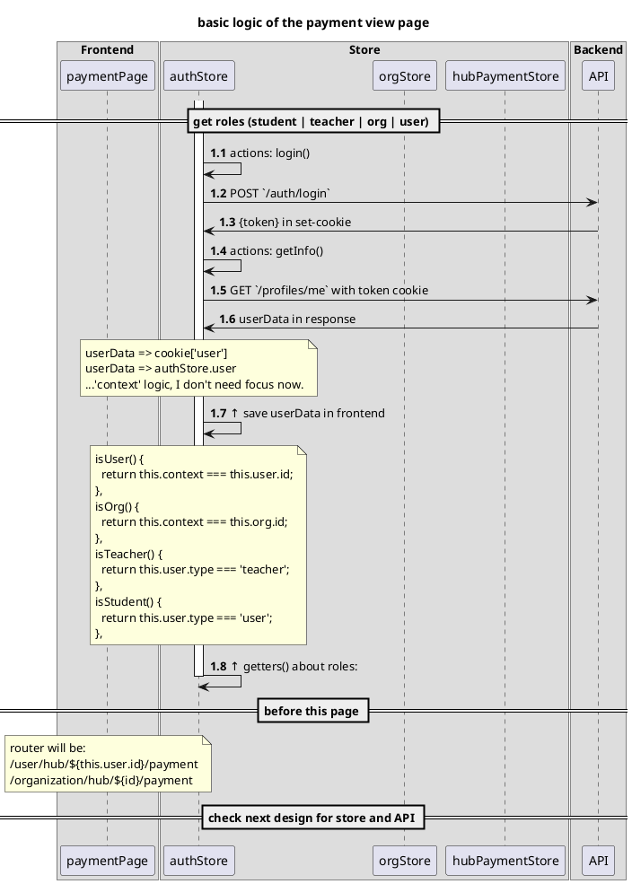
```plantuml
@startuml
title "basic logic of the payment view page"

box "Frontend"
participant paymentPage
end box

box "Store"
participant authStore
participant orgStore
participant hubPaymentStore
end box

box "Backend"
participant API
end box

== get roles (student | teacher | org | user) ==
autonumber 1.1
activate authStore
authStore -> authStore : actions: login()
authStore -> API : POST `/auth/login`
API -> authStore: {token} in set-cookie
authStore -> authStore: actions: getInfo()
authStore -> API: GET `/profiles/me` with token cookie
authStore <- API: userData in response

note over authStore
userData => cookie['user']
userData => authStore.user
...'context' logic, I don't need focus now.
end note
authStore -> authStore: ↑ save userData in frontend
note over authStore
isUser() {
  return this.context === this.user.id;
},
isOrg() {
  return this.context === this.org.id;
},
isTeacher() {
  return this.user.type === 'teacher';
},
isStudent() {
  return this.user.type === 'user';
},
end note
authStore -> authStore: ↑ getters() about roles:
deactivate authStore

== before this page ==

note over paymentPage
router will be:
/user/hub/${this.user.id}/payment
/organization/hub/${id}/payment
end note

== check next design for store and API == 
@enduml
```
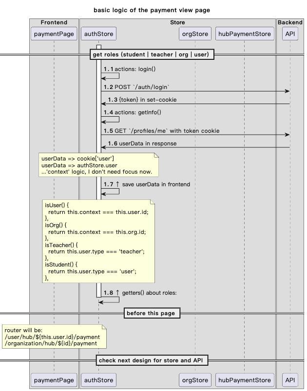  

#### Payment view page store design
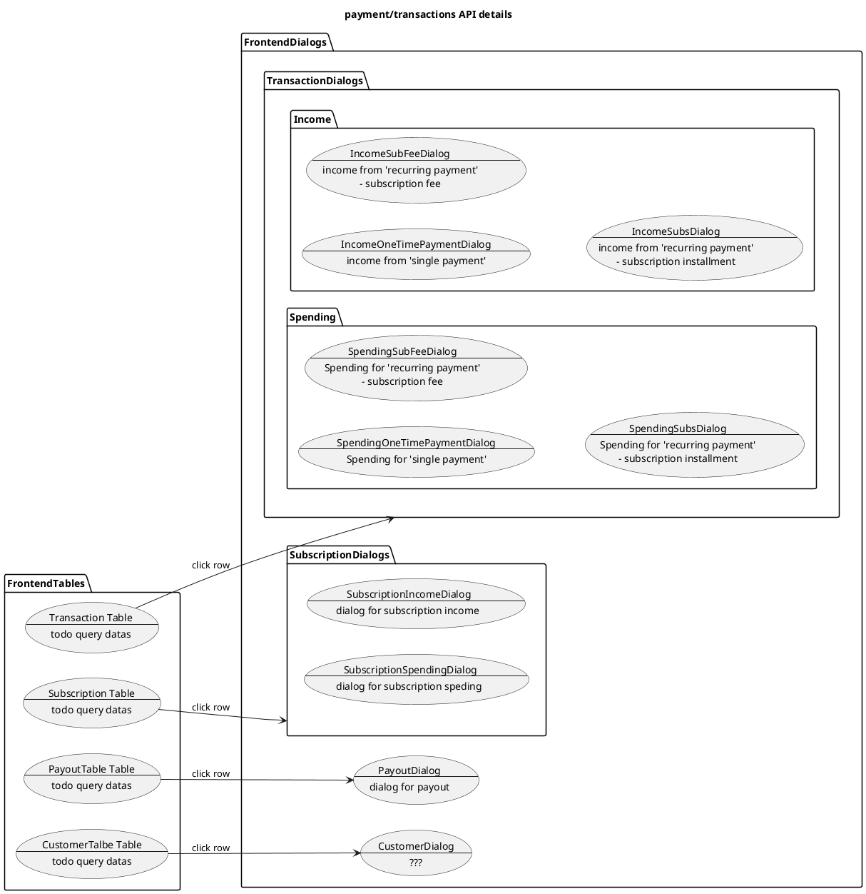
```plantuml
@startuml
title payment/transactions API details

left to right direction

package FrontendTables {
  usecase TransactionTable as "
    Transaction Table
    ---
    todo query datas
  "
  usecase SubscriptionTable as "
    Subscription Table
    ---
    todo query datas
  "
  usecase PayoutTable as "
    PayoutTable Table
    ---
    todo query datas
  "
  usecase CustomerTalbe as "
    CustomerTalbe Table
    ---
    todo query datas
  "
}

package FrontendDialogs {
  package TransactionDialogs {
    package Income {
      usecase IncomeOneTimePaymentDialog as "
        IncomeOneTimePaymentDialog
        ---
        income from 'single payment'
      "

      usecase IncomeSubFeeDialog as "
        IncomeSubFeeDialog
        ---
        income from 'recurring payment'
        - subscription fee
      "

      usecase IncomeSubsDialog as "
        IncomeSubsDialog
        ---
        income from 'recurring payment'
        - subscription installment
      "
    }

    package Spending {
      usecase SpendingOneTimePaymentDialog as "
        SpendingOneTimePaymentDialog
        ---
        Spending for 'single payment'
      "

      usecase SpendingSubFeeDialog as "
        SpendingSubFeeDialog
        ---
        Spending for 'recurring payment'
        - subscription fee
      "

      usecase SpendingSubsDialog as "
        SpendingSubsDialog
        ---
        Spending for 'recurring payment'
        - subscription installment
      "
    }
  }

  package SubscriptionDialogs {
    usecase SubscriptionIncomeDialog as "
      SubscriptionIncomeDialog
      ---
      dialog for subscription income 
    "

    usecase SubscriptionSpendingDialog as "
      SubscriptionSpendingDialog
      ---
      dialog for subscription speding 
    "
  }


  usecase PayoutDialog as "
    PayoutDialog
    ---
    dialog for payout
  "

  usecase CustomerDialog as "
    CustomerDialog
    ---
    ???
  "
}


PayoutTable --> PayoutDialog: click row
CustomerTalbe --> CustomerDialog: click row
SubscriptionTable --> SubscriptionDialogs: click row
TransactionTable --> TransactionDialogs: click row

@enduml
```

#### Transaction API details

| No. | UI selected tabs         | Endpoints                     | queryParams            |
| --- | ------------------------ | ----------------------------- | ---------------------- |
| 1   | Spending + Transactions  | /payment/transactions/search  | filterQuery = spending |
| 2   | Spending + Subscriptions | /payment/subscriptions/search | filterQuery = spending |
| 3   | Sales    + Transactions  | /payment/transactions/search  | filterQuery = incoming |
| 4   | Sales    + Subscriptions | /payment/subscriptions/search | filterQuery = incoming |
| 5   | Payout                   | /payment/payouts              | ---                    |
| 6   | Customers                |                               | ???                    |

#### Dialogs navigation requirement and design
Types:

| No.  | Data Type               | Navigation                                              | breadcrumbs                                  |
| ---- | ----------------------- | ------------------------------------------------------- | -------------------------------------------- |
| 1    | Spending + Transaction  | Transaction -> Subscription                             | Transaction > Subscription                   |
| 1.1  | Spending + Transaction  | Transaction -> Subscription -> Transaction2             | Transaction > Subscription > Transaction2    |
| 2.1  | Sales    + Transaction  | Transaction -> Subscription                             | Transaction > Subscription                   |
| 2.2  | Sales    + Transaction  | Transaction -> Payout                                   | Transaction > Payout                         |
| 3    | Spending + Subscription | Subscription -> Transaction                             | Subscription > Transaction                   |
| 4    | Sales    + Subscription | Subscription -> Transaction                             | Subscription > Transaction                   |
| 4.1  | Sales    + Subscription | Subscription -> Transaction -> payout                   | Subscription > Transaction > payout          |
| 5    | Payout                  | Payout -> Transaction                                   | Payout > Transaction                         |
| 6.1  | Customers               | Customers -> Transaction                                | Customers > Transaction                      |
| 6.2  | Customers               | Customers -> Subscription                               | Customers > Subscription                     |
| 6.3  | Customers               | Customers -> Transaction View All                       | Customers > Transaction(num)                 |
| 6.31 | Customers               | Customers -> Transaction View All -> Transaction        | Customers > Transaction(num) > Transaction   |
| 6.4  | Customers               | Customers -> Subscription View ALl                      | Customers > Subscription(num)                |
| 6.41 | Customers               | Customers -> Subscription View All -> Subscription      | Customers > Subscription(num) > Subscription |
| --   | --                      | more than 3 levels                                      | --                                           |
| 7.1? | Customers               | Cus -> Subs_View_All -> Sub -> Trans                    | Customers > ...(dropdown) > Trans            |
| 7.2? | Customers               | Cus -> Subs_View_All -> Sub -> Trans -> payout          | Customers > ...(dropdown) > Payout           |
| 7.3? | Customers               | Cus -> Tran_View_All -> Trans-> payout                  | Customers > ...(dropdown) > Payout           |
| 7.3? | Customers               | Cus -> Tran_View_All -> Trans-> Sub                     | Customers > ...(dropdown) > Sub              |
| 7.4? | Customers               | Cus -> Tran_View_All -> Trans-> Sub -> Trans'           | Customers > ...(dropdown) > Trans            |
| 7.5? | Customers               | Cus -> Tran_View_All -> Trans-> Sub -> Trans' -> payout | Customers > ...(dropdown) > payout           |


Operation Cases:

| Case        | Description               | Nav Title                     | Body                        |
| ----------- | ------------------------- | ----------------------------- | --------------------------- |
| open lv1    | Open dialog from table    | lv1 type name                 | loading by lv1 type         |
| lv1 => lv2  | From lv1                  | lv1 type name + lv2 type name | loading by lv2 type         |
| lv2 => lv1  | Click lv1 title           | lv1 type name                 | back to loading by lv1 type |
| lv2 => lv1  | Click SameId as lv1 title | lv1 type name                 | back to loading by lv1 type |
| lv2 => lv3  | from lv2                  | lv1 > lv2 > lv3               | loading by lv3 type         |
| lv2 => lv1' | visit another lv1 type    | lv1 > lv2 > lv1'              | loading by lv1' type        |


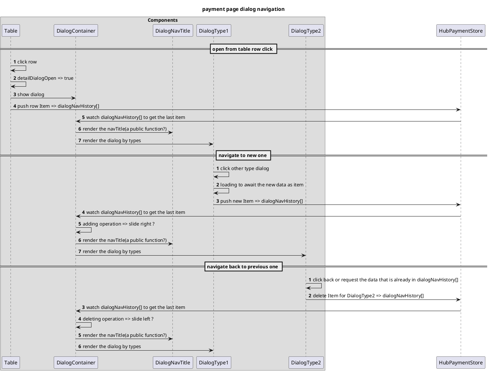
```plantuml
@startuml
title "payment page dialog navigation"

box Components
participant Table
participant DialogContainer
participant DialogNavTitle
participant DialogType1
participant DialogType2
end box

participant HubPaymentStore

== open from table row click ==
autonumber
Table -> Table: click row
Table -> Table: detailDialogOpen => true
Table -> DialogContainer: show dialog
Table -> HubPaymentStore: push row Item => dialogNavHistory[]
DialogContainer <- HubPaymentStore: watch dialogNavHistory[] to get the last item
DialogContainer -> DialogNavTitle: render the navTitle(a public function?)
DialogContainer -> DialogType1: render the dialog by types
autonumber stop

== navigate to new one ==
autonumber
DialogType1 -> DialogType1: click other type dialog
DialogType1 -> DialogType1: loading to await the new data as item
DialogType1 -> HubPaymentStore: push new Item => dialogNavHistory[]
DialogContainer <- HubPaymentStore: watch dialogNavHistory[] to get the last item
DialogContainer -> DialogContainer: adding operation => slide right ?
DialogContainer -> DialogNavTitle: render the navTitle(a public function?)
DialogContainer -> DialogType2: render the dialog by types

== navigate back to previous one ==
autonumber
DialogType2 -> DialogType2: click back or request the data that is already in dialogNavHistory[]
DialogType2 -> HubPaymentStore: delete Item for DialogType2 => dialogNavHistory[]
DialogContainer <- HubPaymentStore: watch dialogNavHistory[] to get the last item
DialogContainer -> DialogContainer: deleting operation => slide left ?
DialogContainer -> DialogNavTitle: render the navTitle(a public function?)
DialogContainer -> DialogType1: render the dialog by types
@enduml
```

#### Balance Status
| Payout Way | Name                 | Description From Stripe                                                                       |
| ---------- | -------------------- | --------------------------------------------------------------------------------------------- |
| manual     | Total Balance        | Recent earnings from Aladia, Corp. that are pending or available in your Stripe balance.      |
| manual     | Available to pay out | You are using manual payouts. <br/> To set up automatic payouts, adjust your payout settings. |
| manual     | Available soon       | This amount is estimated because transactions are still accumulating.                         |
| manual     | In transit to bank   | On the way to your bank                                                                       |
| auto       | Total Balance        | Recent earnings from Aladia, Corp. that are pending or available in your Stripe balance.      |
| auto       | Future payouts       | Upcoming payouts to your bank (estimated)                                                     |
| auto       | In transit to bank   | On the way to your bank                                                                       |


#### Transaction Status details
| Types         | Status                | Color  |
| ------------- | --------------------- | ------ |
| Transactions  | Successful            | Green  |
| Transactions  | Failed                | Red    |
| Transactions  | Pending               | Orange |
| Subscriptions | Active                | Green  |
| Subscriptions | Past Due              | Red    |
| Subscriptions | Canceled => Completed | Green  |
| Subscriptions | Unpaid                | Brown  |
| Payouts       | Paid                  | Green  |
| Payouts       | Failed                | Red    |
| Payouts       | Pending               | Orange |
| Payouts       | InTransit             | Brown  |
| Payouts       | Canceled              | Grey   |

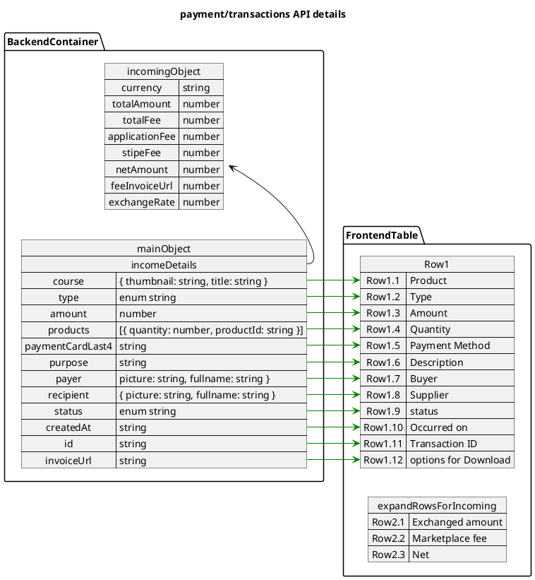
```plantuml
@startuml
title payment/transactions API details

left to right direction

package FrontendTable {
  map Row1 {    
    Row1.1 => Product
    Row1.2 => Type
    Row1.3 => Amount
    Row1.4 => Quantity
    Row1.5 => Payment Method
    Row1.6 => Description
    Row1.7 => Buyer
    Row1.8 => Supplier
    Row1.9 => status
    Row1.10 => Occurred on
    Row1.11 => Transaction ID
    Row1.12 => options for Download
  }

  map expandRowsForIncoming {
    Row2.1 => Exchanged amount
    Row2.2 => Marketplace fee
    Row2.3 => Net
  } 
}

package BackendContainer {
  map incomingObject {
    currency => string
    totalAmount => number
    totalFee => number
    applicationFee => number
    stipeFee => number
    netAmount => number
    feeInvoiceUrl  => number
    exchangeRate => number
  }

  map mainObject {
    incomeDetails *-> incomingObject
    course => { thumbnail: string, title: string }
    type => enum string
    amount => number
    products => [{ quantity: number, productId: string }]
    paymentCardLast4 => string
    purpose => string
    payer => picture: string, fullname: string }
    recipient => { picture: string, fullname: string }
    status => enum string
    createdAt => string
    id => string
    invoiceUrl => string
  }
}

' Row1
mainObject::course --> Row1::Row1.1 #line:green;
mainObject::type --> Row1::Row1.2 #line:green;
mainObject::amount --> Row1::Row1.3 #line:green;
mainObject::products --> Row1::Row1.4 #line:green;
mainObject::paymentCardLast4 --> Row1::Row1.5 #line:green;
mainObject::purpose --> Row1::Row1.6 #line:green;
mainObject::payer ---> Row1::Row1.7 #line:green;
mainObject::recipient --> Row1::Row1.8 #line:green;
mainObject::status --> Row1::Row1.9 #line:green;
mainObject::createdAt --> Row1::Row1.10 #line:green;
mainObject::id --> Row1::Row1.11 #line:green;
mainObject::invoiceUrl --> Row1::Row1.12 #line:green;

@enduml
```
#### Generate new payout test data
1. search `{ email: "${email}" }` in `db.profiles`, get `ObjectId`
2. search `{ "owner.id": ObjectId(ObjectId) }` in `db.connect_accounts`, get `stripeAccountId`
3. stripe dashboard search `stripeAccountId`
4. add funds (need admin roles)
5. send the curl
```sh
curl https://api.stripe.com/v1/payouts   -u "sk_test_51MI5jvHQzZdDmyPqTcZAbnyXsnkoAVOtsGZrwE740yXabYy7gE2DsC49RPTbRKM0to7s72NiEqa3KjNkczrLxJh9009NsXgsDy:"   -H "Stripe-Account: ${stripeAccountId}"   -d amount=100   -d currency=eur
```

### Become teacher
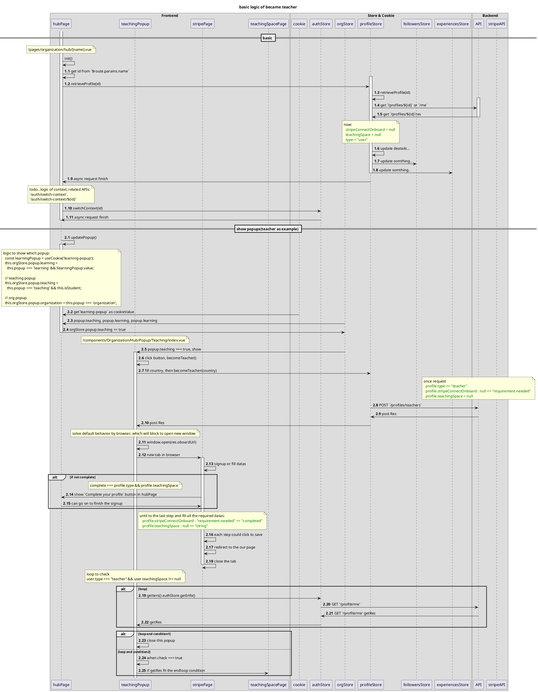
```plantuml
@startuml
title "basic logic of became teacher"

box "Frontend"
participant hubPage
participant teachingPopup
participant stripePage
participant teachingSpacePage
end box

box "Store & Cookie"
participant cookie
participant authStore
participant orgStore
participant profileStore
participant followersStore
participant experiencesStore
end box

box "Backend"
participant API
participant stripeAPI
end box

== basic ==
activate hubPage
note over hubPage
/pages/organization/hub/[name].vue
end note
hubPage -> hubPage : init()
autonumber 1.1
hubPage -> hubPage : get id from `$route.params.name`
  activate profileStore
    hubPage -> profileStore : retrieveProfile(id)
    profileStore -> profileStore : retrieveProfile(id)
      activate API
      profileStore -> API : get `/profiles/${id}` or `/me`
      profileStore <- API : get `/profiles/${id}`res
      deactivate API
    note over profileStore
    now:
    <color green>  stripeConnectOnboard = null
    <color green>  teachingSpace = null
    <color green>  type = "user"
    end note
    profileStore -> profileStore : update deatails...
    profileStore -> followersStore : update somthing..
    profileStore -> experiencesStore: update somthing..
  deactivate profileStore
hubPage <- profileStore : async request finish

note over hubPage
todo...logic of context, related APIs:
`/auth/switch-context`,
`/auth/switch-context/${id}`
end note
hubPage -> authStore : switchContext(id)
hubPage <- authStore : async request finish
deactivate hubPage
autonumber stop

== show popups(teacher as example) ==
autonumber 2.1
hubPage -> hubPage : updatePopup()
activate hubPage
note over hubPage
logic to show which popup:
  const learningPopup = useCookie('learning-popup');
  this.orgStore.popup.learning =
    this.popup === 'learning' && !learningPopup.value;

  // teaching popup
  this.orgStore.popup.teaching =
    this.popup === 'teaching' && this.isStudent;

  // org popup
  this.orgStore.popup.organization = this.popup === 'organization';
end note
hubPage <- cookie : get`learning-popup` as cookieValue
hubPage <- orgStore : popup.teaching, popup.learning, popup.learning
hubPage -> orgStore : orgStore.popup.teaching => true
deactivate hubPage

note over teachingPopup
/components/Organization/Hub/Popup/Teaching/index.vue
end note
teachingPopup <- orgStore: popup.teaching === true, show
activate teachingPopup
teachingPopup -> teachingPopup: click button, becomeTeacher()
teachingPopup -> profileStore: fill country, then becomeTeacher(country)
note over API
once request
<color green>  profile.type => "teacher"
<color green>  profile.stripeConnectOnboard : null => "requirement-needed"
<color green>  profile.teachingSpace = null
end note
profileStore -> API: POST `/profiles/teachers`
profileStore <- API: post Res
profileStore -> teachingPopup: post Res
note over teachingPopup
solve default behavior by browser, which will block to open new window
end note
teachingPopup -> teachingPopup: window.open(res.oboardUrl)
  teachingPopup -> stripePage: new tab in browser
  activate stripePage
  stripePage -> stripePage : signup or fill datas
  alt if not complete
    note over teachingPopup
      complete === profile.type && profile.teachingSpace
    end note
    hubPage <- stripePage: show `Complete your profile` button in hubPage
    hubPage -> stripePage: can go on to finish the signup
  end
  note over stripePage
    until to the last step and fill all the required datas:
    <color green>   profile.stripeConnectOnboard : "requirement-needed" => "completed"
    <color green>   profile.teachingSpace : null => "string"
  end note
  stripePage -> stripePage : each step could click to save
  stripePage -> stripePage : redirect to the our page
  stripePage -> stripePage : close the tab
  deactivate stripePage

note over teachingPopup
loop to check
user.type === "teacher" && user.teachingSpace !== null
end note
alt loop
teachingPopup -> authStore : getters() authStore.getInfo()
authStore -> API : GET '/profile/me'
authStore <- API : GET '/profile/me' getRes
teachingPopup <- authStore : getRes
end
alt loop end condition1
teachingPopup -> teachingPopup : close this popup
else loop end condition2
teachingPopup -> teachingPopup : when check === true
teachingPopup -> teachingSpacePage : if getRes fit the endloop condition
end

@enduml
```
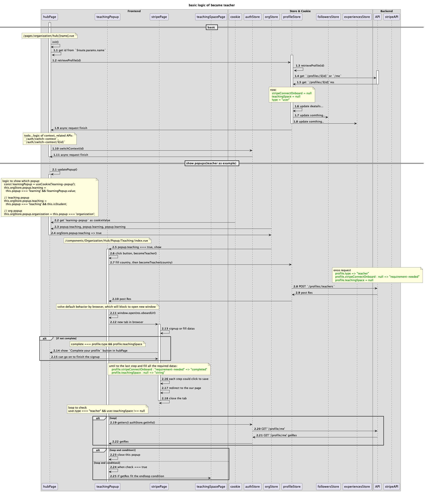  

### Checkout
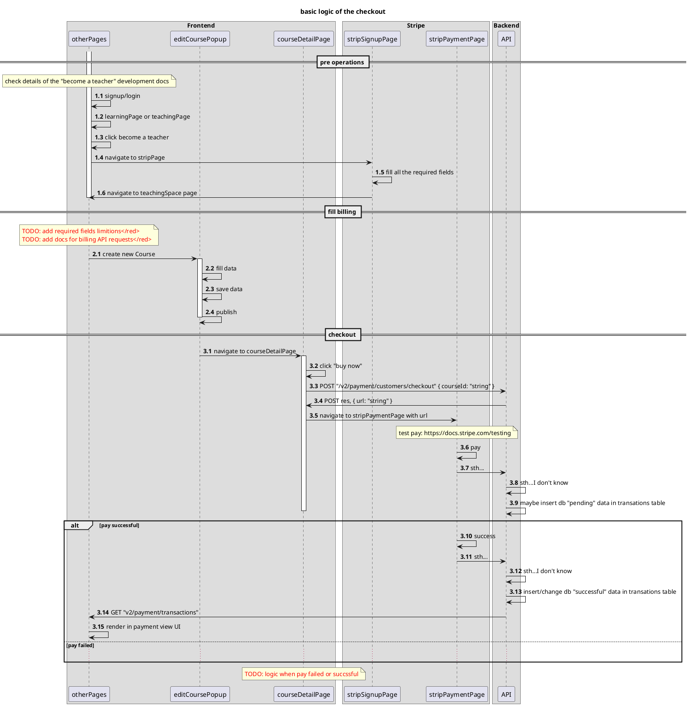
```plantuml
@startuml
title "basic logic of the checkout"

box "Frontend"
participant otherPages
participant editCoursePopup
participant courseDetailPage
end box

box "Stripe"
participant stripSignupPage
participant stripPaymentPage
end box

box "Store"
' participant authStore
' participant orgStore
' participant hubPaymentStore
end box

box "Backend"
participant API
end box

== pre operations ==
autonumber 1.1
activate otherPages
note over otherPages
check details of the "become a teacher" development docs
end note 
otherPages -> otherPages: signup/login
otherPages -> otherPages: learningPage or teachingPage
otherPages -> otherPages: click become a teacher
otherPages -> stripSignupPage: navigate to stripPage
stripSignupPage -> stripSignupPage: fill all the required fields
otherPages <- stripSignupPage: navigate to teachingSpace page
deactivate otherPages

== fill billing ==
autonumber 2.1
note over otherPages
<color red>TODO: add required fields limitions</red>
<color red>TODO: add docs for billing API requests</red>
end note 
otherPages -> editCoursePopup: create new Course 
activate editCoursePopup
editCoursePopup -> editCoursePopup: fill data
editCoursePopup -> editCoursePopup: save data
editCoursePopup -> editCoursePopup: publish
deactivate editCoursePopup

== checkout ==
autonumber 3.1
editCoursePopup -> courseDetailPage: navigate to courseDetailPage
activate courseDetailPage
courseDetailPage -> courseDetailPage : click "buy now"
courseDetailPage -> API: POST "/v2/payment/customers/checkout" { courseId: "string" }
courseDetailPage <- API: POST res, { url: "string" }
courseDetailPage -> stripPaymentPage: navigate to stripPaymentPage with url
note over stripPaymentPage
test pay: https://docs.stripe.com/testing
end note 
stripPaymentPage -> stripPaymentPage: pay
stripPaymentPage -> API: sth...
API -> API: sth...I don't know
API -> API: maybe insert db "pending" data in transations table
deactivate courseDetailPage

alt pay successful
stripPaymentPage -> stripPaymentPage: success
stripPaymentPage -> API: sth...
API -> API: sth...I don't know
API -> API: insert/change db "successful" data in transations table
otherPages <- API: GET "v2/payment/transactions"
otherPages -> otherPages: render in payment view UI
else pay failed
...
end

note over courseDetailPage
<color red>TODO: logic when pay failed or succssful</color>
end note 
@enduml
```
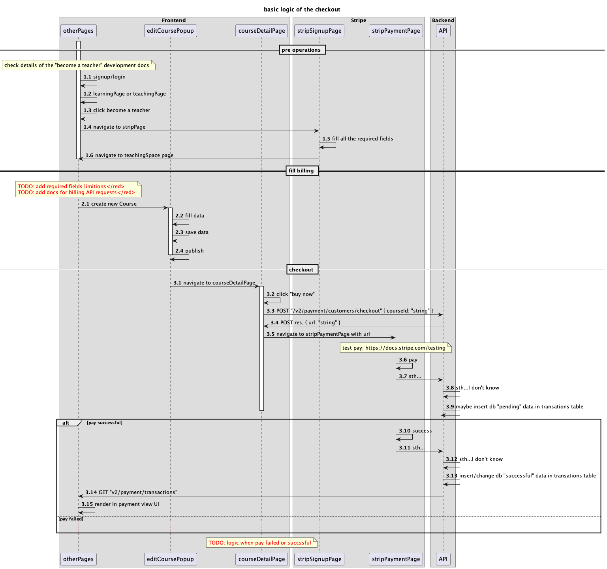  


### checkout2 for public use
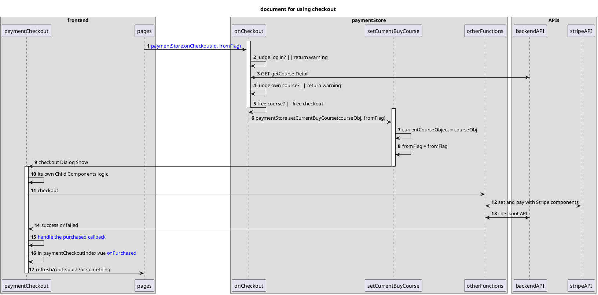
```plantuml
@startuml
title "document for using checkout"

box "frontend"
participant paymentCheckout
participant pages
end box

box "paymentStore"
participant onCheckout
participant setCurrentBuyCourse
participant otherFunctions
end box

box "APIs"
participant backendAPI
participant stripeAPI
end box


autonumber
activate onCheckout
pages -> onCheckout : <color blue>paymentStore.onCheckout(id, fromFlag)</color>
onCheckout -> onCheckout: judge log in? || return warning
onCheckout <-> backendAPI: GET getCourse Detail
onCheckout -> onCheckout: judge own course? || return warning
onCheckout -> onCheckout: free course? || free checkout
deactivate onCheckout

activate setCurrentBuyCourse
onCheckout -> setCurrentBuyCourse: paymentStore.setCurrentBuyCourse(courseObj, fromFlag)
setCurrentBuyCourse -> setCurrentBuyCourse: currentCourseObject = courseObj
setCurrentBuyCourse -> setCurrentBuyCourse: fromFlag = fromFlag
setCurrentBuyCourse -> paymentCheckout: checkout Dialog Show
deactivate setCurrentBuyCourse


activate paymentCheckout
paymentCheckout -> paymentCheckout: its own Child Components logic
paymentCheckout -> otherFunctions: checkout
otherFunctions <-> stripeAPI: set and pay with Stripe components
otherFunctions <-> backendAPI: checkout API
paymentCheckout <- otherFunctions: success or failed

paymentCheckout -> paymentCheckout: <color blue>handle the purchased callback</color>
paymentCheckout -> paymentCheckout: in paymentCheckoutindex.vue <color blue>onPurchased</color>
paymentCheckout -> pages: refresh/route.push/or something
deactivate paymentCheckout
@enduml
```

### Save Card with Stripe PaymentElement

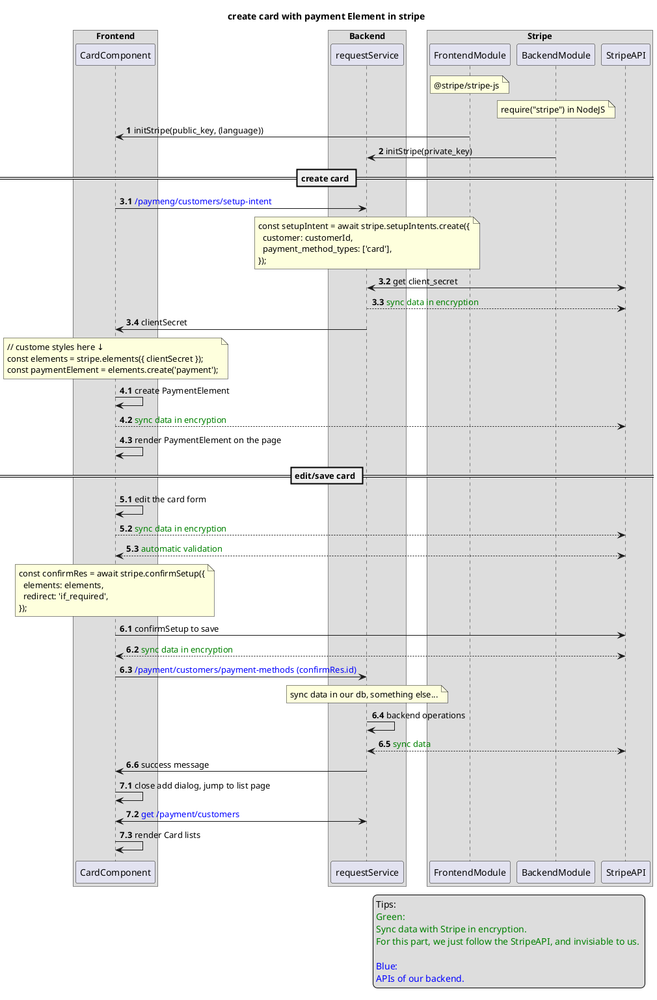
```plantuml
@startuml
title "create card with payment Element in stripe"
legend right
  Tips:
  <color green>Green: </color>
  <color green>Sync data with Stripe in encryption.</color>
  <color green>For this part, we just follow the StripeAPI, and invisiable to us. </color>

  <color blue>Blue: </color>
  <color blue>APIs of our backend.</color>
end legend

box "Frontend"
participant CardComponent
end box

box "Backend"
participant requestService
end box

box Stripe
participant FrontendModule
participant BackendModule
participant StripeAPI
end box

note over FrontendModule
@stripe/stripe-js
end note
note over BackendModule
require("stripe") in NodeJS
end note

autonumber
CardComponent <- FrontendModule : initStripe(public_key, (language))
requestService <- BackendModule : initStripe(private_key)

== create card ==
autonumber 3.1
CardComponent -> requestService: <color blue>/paymeng/customers/setup-intent
note over requestService
const setupIntent = await stripe.setupIntents.create({
  customer: customerId,
  payment_method_types: ['card'],
});
end note
requestService <-> StripeAPI: get client_secret
requestService --> StripeAPI : <color green>sync data in encryption</color>
CardComponent <- requestService: clientSecret
autonumber 4.1
note over CardComponent
// custome styles here ↓
const elements = stripe.elements({ clientSecret });
const paymentElement = elements.create('payment');
end note
CardComponent -> CardComponent : create PaymentElement
CardComponent --> StripeAPI : <color green>sync data in encryption</color>
CardComponent -> CardComponent : render PaymentElement on the page

== edit/save card ==
autonumber 5.1
CardComponent -> CardComponent : edit the card form
CardComponent --> StripeAPI : <color green>sync data in encryption</color>
CardComponent <--> StripeAPI : <color green>automatic validation</color>
autonumber 6.1
note over CardComponent
const confirmRes = await stripe.confirmSetup({
  elements: elements,
  redirect: 'if_required',
});
end note
CardComponent -> StripeAPI : confirmSetup to save
CardComponent <--> StripeAPI : <color green>sync data in encryption</color>
CardComponent -> requestService : <color blue>/payment/customers/payment-methods (confirmRes.id)
note over requestService
sync data in our db, something else...
end note
requestService -> requestService : backend operations
requestService <--> StripeAPI : <color green>sync data</color>
CardComponent <- requestService : success message

autonumber 7.1
CardComponent -> CardComponent : close add dialog, jump to list page
CardComponent <-> requestService : <color blue>get /payment/customers
CardComponent -> CardComponent : render Card lists
@enduml
```

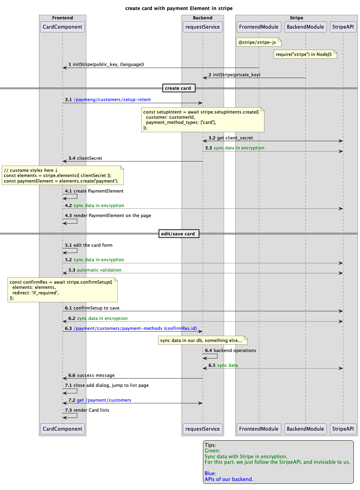  

### Roles about buy more than one licenses
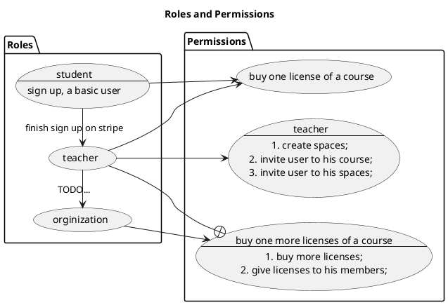
```plantuml
@startuml
title "Roles and Permissions"

left to right direction

package Roles {
  usecase studentRole as "
    student
    ---
    sign up, a basic user
  "

  usecase teacherRole as "
    teacher
  "

  usecase orginizationRole as "
    orginization
  "
}

package Permissions {
  usecase buyOne as "
    buy one license of a course
  "

  usecase teacherP as "
    teacher
    ---
    1. create spaces; 
    2. invite user to his course;
    3. invite user to his spaces;
  "

  usecase buyMore as "
    buy one more licenses of a course
    ---
    1. buy more licenses;
    2. give licenses to his members;
  "
}

studentRole --> buyOne
teacherRole --> buyOne
teacherRole --> teacherP
teacherRole --+ buyMore
orginizationRole --> buyMore

studentRole -> teacherRole : finish sign up on stripe
teacherRole -> orginizationRole : TODO...

@enduml
```
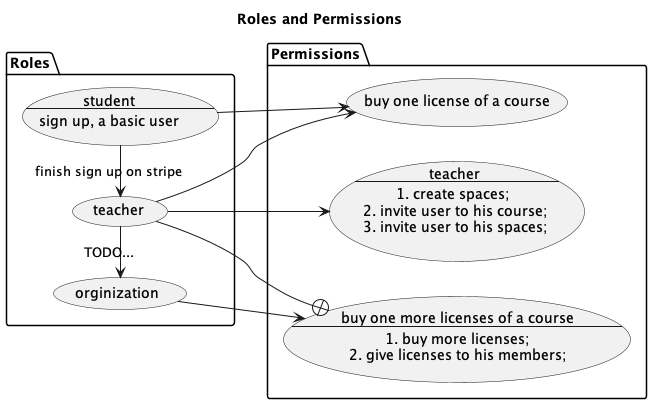  


### Become Teacher Or Organization
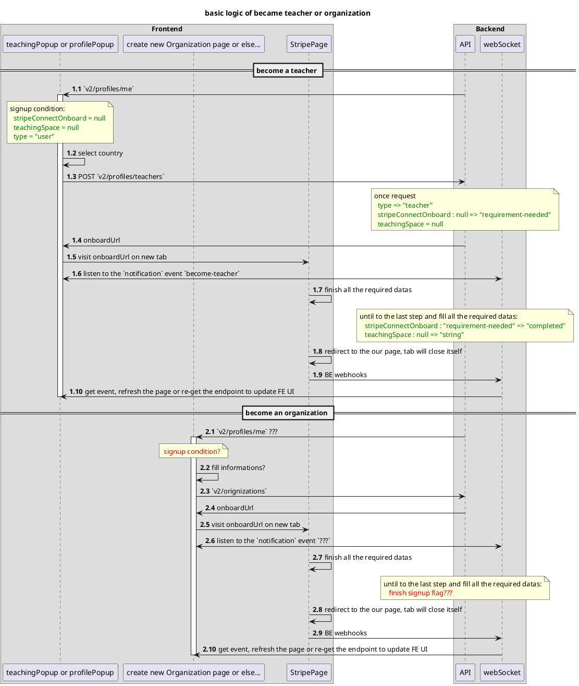
```plantuml
@startuml
title "basic logic of became teacher or organization"

box "Frontend"
participant teacherCom as "teachingPopup or profilePopup"
participant orgCom as "create new Organization page or else..."
participant StripePage
end box

box "Backend"
participant API
participant webSocket
end box

== become a teacher ==
autonumber 1.1
teacherCom <- API: `v2/profiles/me`
activate teacherCom
note over teacherCom
signup condition:
<color green>  stripeConnectOnboard = null
<color green>  teachingSpace = null
<color green>  type = "user"
end note
teacherCom -> teacherCom: select country
teacherCom -> API: POST `v2/profiles/teachers`
note over API
once request
<color green>  type => "teacher"
<color green>  stripeConnectOnboard : null => "requirement-needed"
<color green>  teachingSpace = null
end note
teacherCom <- API: onboardUrl
teacherCom -> StripePage: visit onboardUrl on new tab
teacherCom <-> webSocket: listen to the `notification` event `become-teacher`

StripePage -> StripePage: finish all the required datas
note over API
  until to the last step and fill all the required datas:
  <color green>   stripeConnectOnboard : "requirement-needed" => "completed"
  <color green>   teachingSpace : null => "string"
end note
StripePage -> StripePage: redirect to the our page, tab will close itself
StripePage -> webSocket: BE webhooks
webSocket -> teacherCom: get event, refresh the page or re-get the endpoint to update FE UI
deactivate teacherCom


== become an organization ==
autonumber 2.1
orgCom <- API: `v2/profiles/me` ???
activate orgCom
note over orgCom
<color red> signup condition?
end note
orgCom -> orgCom: fill informations?
orgCom -> API: `v2/orignizations`
orgCom <- API: onboardUrl
orgCom -> StripePage: visit onboardUrl on new tab
orgCom <-> webSocket: listen to the `notification` event `???`

StripePage -> StripePage: finish all the required datas
note over API
  until to the last step and fill all the required datas:
  <color red>   finish signup flag???
end note
StripePage -> StripePage: redirect to the our page, tab will close itself
StripePage -> webSocket: BE webhooks
webSocket -> orgCom: get event, refresh the page or re-get the endpoint to update FE UI
deactivate orgCom
@enduml
```

### Escrow
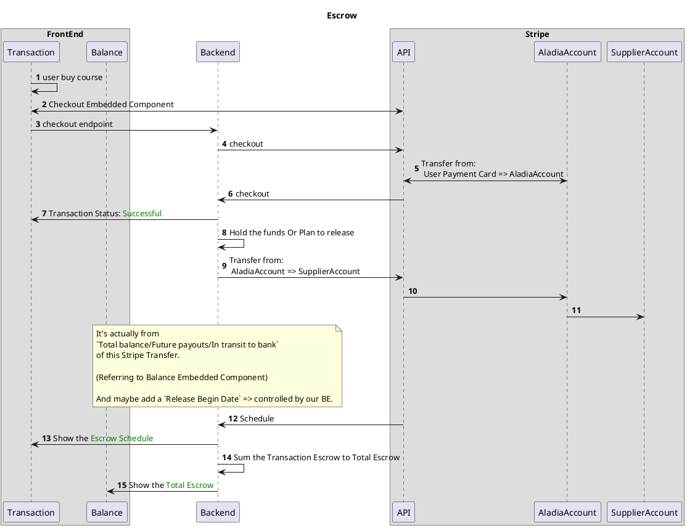
```plantuml
@startuml
title "Escrow"

box FrontEnd
participant Transaction
participant Balance
end box

participant Backend

box Stripe
participant API
participant AladiaAccount
participant SupplierAccount
end box

autonumber
Transaction -> Transaction: user buy course
Transaction <-> API: Checkout Embedded Component
Transaction -> Backend: checkout endpoint
Backend -> API: checkout
API <-> AladiaAccount: Transfer from: \n User Payment Card => AladiaAccount
Backend <- API: checkout
Transaction <- Backend: Transaction Status: <color green>Successful</color>
Backend -> Backend: Hold the funds Or Plan to release
Backend -> API: Transfer from: \n AladiaAccount => SupplierAccount
API -> AladiaAccount
AladiaAccount -> SupplierAccount
note over Backend
It's actually from
`Total balance/Future payouts/In transit to bank`
of this Stripe Transfer.

(Referring to Balance Embedded Component) 

And maybe add a `Release Begin Date` => controlled by our BE.
end note
Backend <- API: Schedule
Backend -> Transaction: Show the <color green>Escrow Schedule</color>

Backend -> Backend: Sum the Transaction Escrow to Total Escrow
Backend -> Balance: Show the <color green>Total Escrow</color>
@enduml
```

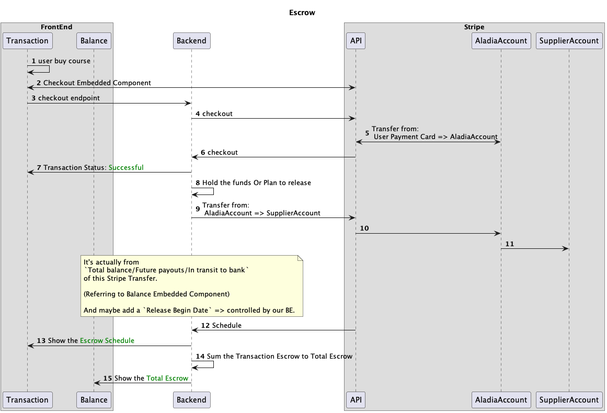  


## Roles
Pages: Market, Payment, Calendar, Spaces, Chat, Q&A, Review, Profile, Feed, Management, ...
Event: BuyCourse, UserOnboarding, OrgOnboarding, SubServices, AddPaymentCard, RequestServicesUses, ViewBalance...


| Roles        | Lvl | Page/Component | Event | FE dependency                         |
| ------------ | --- | -------------- | ----- | ------------------------------------- |
| User         | 1   | --             | --    | /me => type                           |
| Teacher      | 1   | --             | --    | /me => type                           |
| Admin        | 1   | --             | --    | /me => type                           |
| Organization | 1   | --             | --    | todo                                  |
| Org-owner    | 2   | --             | --    | /organizations/{id} => activeUserRole |
| Org-admin    | 2   | --             | --    | /organizations/{id} => activeUserRole |
| Org-member   | 2   | [no-payment]   | --    | /organizations/{id} => activeUserRole |


# Live log
I added a live log track service in myself website. Example:
```js
  // test log
  fetch(`https://cv.dashuaibi.asia/log`, {
    method: 'POST',
    headers: {
      'Content-Type': 'application/json; charset=utf-8',
    },
    body: JSON.stringify({
      level: 'info',
      message: {
        courseId: eventValue.courseId,
        profileId: eventValue.profileId,
        timeSpend: `${timeSpend}s`,
      },
    }),
  });
```